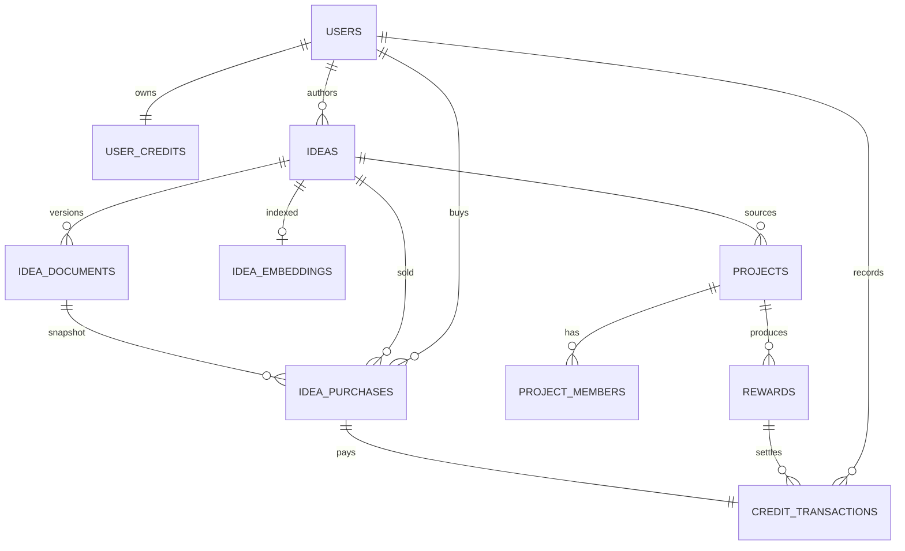

# Seedo

> 일상 속 니즈를 가진 사용자(소비자)와 프로덕트 개발자를 잇는 **Pain Point 마켓플레이스 + 프로젝트 크라우드펀딩** 플랫폼.
> 사용자는 AI 챗봇과 대화하며 자신의 니즈를 정형화된 기획문서로 만들고, 개발자는 크레딧을 지불하고 열람·채택할 수 있다. 채택 시 사용자에게 크레딧 보상이 돌아가며, 채택된 아이디어는 프로젝트로 전환된다.

이 README는 **온보딩용**이다. 다른 개발자분들이 이 ERD를 어떤 포인트로 설계했는지를 한눈에 잡을 수 있게 정리해뒀다.

---

## 현재 단계

- ✅ 도메인 모델 정리 (`docs/`)
- ✅ 전체 테이블 스키마 명세 (`docs/01_DB_SCHEMA.md`)
- ✅ 핵심 트랜잭션 의사 SQL (`docs/02_BUSINESS_LOGIC.md`)
- ✅ Spring vs Supabase 책임 분담 (`docs/03_RESPONSIBILITY_SPLIT.md`)
- ✅ ERD mermaid (`docs/05_ERD.md`)
- ⏳ **백엔드/프론트 구현은 팀 합의 후 시작**

## 레포 구조 (현재)

```
seedo/
├── README.md      ← 지금 보는 파일 (온보딩용 소개)
├── CLAUDE.md      ← AI assistant 작업 가이드 (도메인 규칙 요약)
├── docs/          ← 설계 문서 (00~06)
│   ├── 00_PROJECT_CONTEXT.md
│   ├── 01_DB_SCHEMA.md
│   ├── 02_BUSINESS_LOGIC.md
│   ├── 03_RESPONSIBILITY_SPLIT.md
│   ├── 04_OPEN_QUESTIONS.md
│   ├── 05_ERD.md
│   └── 06_KICKOFF_DECK.md   ← 팀 합의 미팅용
├── backend/       ← Spring Boot 자리 (비어 있음, 합의 전)
│   └── CLAUDE.md
└── web/           ← Next.js 자리 (비어 있음, 합의 전)
    └── CLAUDE.md
```

## 모노레포 구조 (구현 계획)

확정된 스택을 기준으로, 합의 후 다음 트리로 채워나간다.

**기술 스택 (확정)**
- 백엔드: **Java 25** (LTS) + **Spring Boot 3.5+** + **Gradle Groovy DSL** (Kotlin 미사용)
- 프론트: **Next.js** (App Router) + TypeScript + TailwindCSS + shadcn/ui
- DB / Auth / Storage / Realtime: **Supabase Postgres** (단일 DB, Flyway로 마이그레이션 일원화)
- Java 패키지 루트: `dev.seedo`, Application 클래스 `SeedoApplication`

```
seedo/                              ← 깃허브 레포
├── README.md                       ← 프로젝트 소개·실행 방법
├── CLAUDE.md                       ← AI assistant 작업 가이드
├── docs/                           ← 설계 문서 (00~06)
├── .github/
│   ├── workflows/
│   │   ├── backend-ci.yml          ← backend/** 변경 시만
│   │   ├── web-ci.yml              ← web/** 변경 시만
│   │   └── lint.yml
│   ├── PULL_REQUEST_TEMPLATE.md
│   └── ISSUE_TEMPLATE/
│
├── backend/                        ← Spring Boot 모듈 (Java 25)
│   ├── build.gradle                ← Groovy DSL
│   ├── settings.gradle
│   ├── CLAUDE.md
│   ├── src/main/java/dev/seedo/
│   │   ├── SeedoApplication.java
│   │   ├── config/                 ← SecurityConfig, JwtConfig, WebConfig
│   │   ├── auth/                   ← Supabase JWT 검증 필터
│   │   ├── credit/                 ← 도메인 (entity + repo + service + controller)
│   │   ├── idea/
│   │   ├── project/
│   │   ├── reward/
│   │   ├── post/
│   │   ├── ai/                     ← LLM 오케스트레이션
│   │   ├── search/                 ← 임베딩, RAG
│   │   ├── common/                 ← BaseEntity, exceptions
│   │   └── admin/
│   ├── src/main/resources/
│   │   ├── application.yml
│   │   ├── application-local.yml
│   │   ├── application-prod.yml
│   │   └── db/migration/           ← Flyway (V1__init.sql, V2__ideas.sql, ...)
│   └── src/test/java/...
│
├── web/                            ← Next.js (App Router)
│   ├── package.json
│   ├── next.config.js
│   ├── tsconfig.json
│   ├── tailwind.config.ts
│   ├── CLAUDE.md
│   ├── src/
│   │   ├── app/                    ← App Router 페이지
│   │   │   ├── (auth)/login/
│   │   │   ├── (auth)/sign-up/
│   │   │   ├── (main)/idea/
│   │   │   ├── (main)/feed/
│   │   │   ├── (main)/board/
│   │   │   ├── (main)/my-page/
│   │   │   └── api/                ← Spring 프록시 또는 BFF
│   │   ├── components/
│   │   │   ├── ui/                 ← shadcn/ui
│   │   │   ├── idea/
│   │   │   ├── project/
│   │   │   └── shared/
│   │   ├── lib/
│   │   │   ├── supabase/           ← supabase client
│   │   │   ├── api/                ← Spring API 클라이언트
│   │   │   └── utils/
│   │   ├── hooks/
│   │   └── types/                  ← API 응답 타입 (자동 생성 권장)
│   └── public/
│
├── supabase/                       ← Supabase CLI (선택)
│   ├── config.toml
│   ├── migrations/                 ← Flyway 외 보조 (RLS 정책 등 분리할 때만)
│   └── seed.sql
│
├── infra/                          ← 배포·로컬 인프라 (선택)
│   ├── docker-compose.yml          ← 로컬 dev (postgres, mailhog 등)
│   └── Dockerfile.backend
│
├── .gitignore
├── .editorconfig
├── .prettierrc
└── LICENSE
```

> **`supabase/`와 `infra/`는 선택**. Flyway 단일 마이그레이션 도구로 가니 `supabase/migrations/`는 RLS 정책처럼 Supabase 전용 SQL을 분리할 때만 도입. 로컬에서 Docker postgres 띄울 게 아니면 `infra/`도 없어도 됨.

## 도메인 모델

```
User ──작성──▶ Idea ──채택──▶ Project
  │             │              │
  │             │              ├─ Members / Followers / Hypes
  │             │              └─ Posts (홍보·모집)
  │             │
  │             ├─ Documents (버전별 본문)
  │             ├─ ChatSessions (AI 대화 로그)
  │             ├─ Embeddings (검색용)
  │             └─ Purchases (열람권)
  │
  ├─ Posts ──── Applications (베타테스터/개발자 모집)
  ├─ Credits (잔액 + 원장)
  └─ Roles (RBAC)
```

---

## ERD 설계 시 고려한 포인트

이 섹션이 README의 핵심이다. 같은 도메인이라도 여러 스키마가 가능한데, **왜 이 모양으로 끊었는지** 정리한다.

### 1. 크레딧은 잔액 캐시 + 원장 분리

| 테이블 | 역할 |
|---|---|
| `user_credits` | 잔액 캐시 (한 유저 = 한 row) |
| `credit_transactions` | 모든 이동 원장 (append-only) |

- **단일 진실 공급원은 원장**이다. 잔액은 원장을 합산하면 검증 가능한 캐시.
- `credit_transactions`는 **UPDATE/DELETE 금지** (DB 트리거로 차단). 정정이 필요하면 `type='ADJUST'` 새 row를 추가한다.
- `balance_after`를 매 row에 박아 감사 추적이 쉽다.

> **왜 잔액 컬럼 하나로 안 끝내고 분리했나** — 분쟁 시 "왜 이만큼 줄었나"를 증명할 수 있어야 한다. 결제 시스템의 표준 패턴.

### 2. 잔액 변경은 한 트랜잭션 안에서, 직렬화는 비관적 락

크레딧을 건드리는 모든 작업(충전·구매·보상)은:
1. `SELECT ... FROM user_credits WHERE user_id = ? FOR UPDATE` 로 잔액 락
2. 잔액 갱신
3. `credit_transactions` INSERT (`balance_after` 포함)
4. 권한 부여(예: `idea_purchases` row)

이 4단계가 **반드시 같은 트랜잭션 안**에서. 동시에 여러 결제 요청이 와도 락이 직렬화한다. 자세한 시나리오는 [`docs/02_BUSINESS_LOGIC.md`](docs/02_BUSINESS_LOGIC.md).

### 3. 아이디어 버저닝 — 메타와 본문 분리

| 테이블 | 역할 |
|---|---|
| `ideas` | 메타(title, status, author_id, current_version_id, ...) |
| `idea_documents` | 본문(version별 row, content_md) |

- `idea_documents`는 `UNIQUE(idea_id, version)`. 새 버전은 새 row, **기존 버전은 그대로 보존**.
- `ideas.current_version_id`가 published 최신 버전을 가리킴.
- 구매자의 `idea_purchases.document_id`는 **산 시점 스냅샷**(분쟁 방지). 단 실제 접근 권한은 `idea_id` 기준 → 새 버전을 무료로 본다.

> **왜 `ideas.content_md`로 안 끝내고 분리했나** — published 후 수정해도 기존 버전이 살아 있어야 한다. 동시에 사용자 친화적인 "무료 업그레이드" 정책도 가능.

### 4. 프로젝트 채택 시 본문을 복사 (`idea_snapshot_md`)

`projects.idea_snapshot_md`에 채택 시점 idea 본문을 통째로 복사해 둔다. **idea가 후에 삭제·아카이브 되더라도 프로젝트가 살아남는다.** 외래키만으론 부족한 부분(콘텐츠 보존)을 컬럼으로 처리.

### 5. RBAC와 리소스 소유권 분리

- **시스템 권한**(`IDEA_MODERATE`, `CREDIT_REFUND` 등)은 `roles` + `user_roles` + `permissions` + `role_permissions`의 표준 RBAC.
- **"본인 글 수정"** 같은 리소스 소유권은 RBAC가 아니라 코드에서 직접 검증:
  ```java
  @PreAuthorize("@ideaSecurity.isOwner(#ideaId, authentication)")
  ```
- 둘을 섞지 않는다. RBAC에 "내 글 수정" 권한을 넣으면 폭발한다.

### 6. `users.id = auth.users.id` (UUID 공유)

- Supabase Auth가 발급하는 `auth.users.id`(UUID)를 `public.users.id`로 그대로 사용.
- JWT의 `sub` claim이 곧 user_id → 모든 쿼리 단순.
- RLS도 `auth.uid() = users.id` 한 줄로 끝.
- 동기화는 Supabase 표준 패턴인 DB 트리거(`handle_new_user()`)로 자동.

> **왜 별도 `auth_user_id` FK 컬럼을 안 두나** — ID 일원화가 RLS·JWT·쿼리 모두에서 단순하다. Supabase 공식 권장 패턴.

### 7. 댓글은 도메인별 3테이블 (`@MappedSuperclass`로 코드 공유)

```
idea_comments / project_comments / post_comments
```

- 단일 polymorphic `comments` 테이블 + `target_type` 컬럼은 안 쓴다.
- 분리하면 FK 정합성·인덱스·삭제 정책이 깔끔. parent_id self-reference로 1단계 대댓글.
- 코드 중복은 Spring `@MappedSuperclass BaseComment`로 추출.

### 8. Hype vs Follow는 다른 테이블

- **Hype**: 1회성 응원(또는 토글) — 좋아요와 비슷.
- **Follow**: 구독 — 새 글/상태 변화 알림.

서로 의미가 다르므로 하나로 합치지 않는다. `hypes`는 `(idea_id XOR project_id)` 체크로 두 도메인 모두 지원, partial UNIQUE로 중복 방지.

### 9. enum 후보 컬럼은 Postgres enum이 아니라 `varchar + CHECK`

```sql
status varchar(20) NOT NULL CHECK (status IN ('DRAFT', 'PUBLISHED', 'ARCHIVED', 'DELETED'))
```

- Postgres enum은 값 추가·삭제 시 마이그레이션 비용이 크다.
- 검증은 CHECK가 충분히 강력.
- Java/JPA 매핑도 `String` + `@Enumerated(STRING)`이 더 유연.

### 10. 소프트 삭제 우선

- 사용자 작성물은 `status='DELETED'` + `deleted_at`로 표시.
- hard delete는 ADMIN만, FK는 `RESTRICT`로 막힘.
- 좋아요·댓글 같은 종속 데이터는 작성자 hard delete 시 `CASCADE`(작성자 정보 사라져도 OK).

### 11. 멱등성 키 — webhook 재시도 대비

PG 결제 webhook 같은 외부 트리거는 같은 결제가 두 번 들어올 수 있다. `(reference_type='PG_PAYMENT', reference_id=payment_id)` 사전 SELECT 또는 UNIQUE 인덱스로 한 번만 처리.

### 12. 비정규화는 신중하게 — `hype_count` 정도만

- `ideas.hype_count`는 트리거로 동기화.
- 이 외에 카운트 캐시는 두지 않는다(피드 정렬은 인덱스로 처리).

---

## ERD

전체 ERD는 [`docs/05_ERD.md`](docs/05_ERD.md)에 mermaid로 있다. GitHub에서 자동 렌더링된다.

핵심 관계만 발췌:



---

## 상세 명세 위치

| 파일 | 용도 |
|---|---|
| [`docs/00_PROJECT_CONTEXT.md`](docs/00_PROJECT_CONTEXT.md) | 전체 개요·핵심 비즈 규칙·아키텍처 원칙 |
| [`docs/01_DB_SCHEMA.md`](docs/01_DB_SCHEMA.md) | 테이블 컬럼·제약·인덱스·FK 정책 (캐노니컬 스펙) |
| [`docs/02_BUSINESS_LOGIC.md`](docs/02_BUSINESS_LOGIC.md) | 트랜잭션 시퀀스 (의사 SQL) |
| [`docs/03_RESPONSIBILITY_SPLIT.md`](docs/03_RESPONSIBILITY_SPLIT.md) | Spring vs Supabase API 분담표 |
| [`docs/04_OPEN_QUESTIONS.md`](docs/04_OPEN_QUESTIONS.md) | 결정·미결정 사항 모음 |
| [`docs/05_ERD.md`](docs/05_ERD.md) | mermaid ERD 전체 |

`CLAUDE.md`는 AI assistant(Claude Code/Cursor)용 작업 가이드 — 사람이 처음 봐야 할 곳은 이 README와 `docs/`.

---

## 다음 합의 포인트

ERD는 정리됐고, 다음으로 팀에서 논의가 필요한 것:

**기술 스택**
- 백엔드: Spring Boot (현재 가정) ↔ NestJS / FastAPI 등?
- 프론트: Next.js (현재 가정) 확정?
- DB: Supabase Postgres 확정 (Auth/Storage/Realtime 함께)
- 마이그레이션: Flyway 단일 도구로 일원화 (Supabase Studio 직접 변경 금지)

**비즈니스 정책 (`docs/04` 참조)**
- Hype: 1회성 vs 토글 (권장: 토글)
- 한 아이디어 → 여러 프로젝트 허용 여부 (권장: 허용, 보상은 첫 채택자만)
- 아이디어 가격 책정 주체 (권장: MVP는 플랫폼 고정가)
- 채택 보상 금액 산정 (권장: 가격의 50%)
- 본인 아이디어 자가 채택 (권장: 가능, 보상 skip)

**운영**
- 결제 PG (PortOne / Stripe / MVP는 무료 크레딧)
- 알림 채널 (인앱 + Realtime / 이메일 / 푸시)
- 콘텐츠 모더레이션 시점

상세 근거와 권장 사유는 [`docs/04_OPEN_QUESTIONS.md`](docs/04_OPEN_QUESTIONS.md).
# seedo
