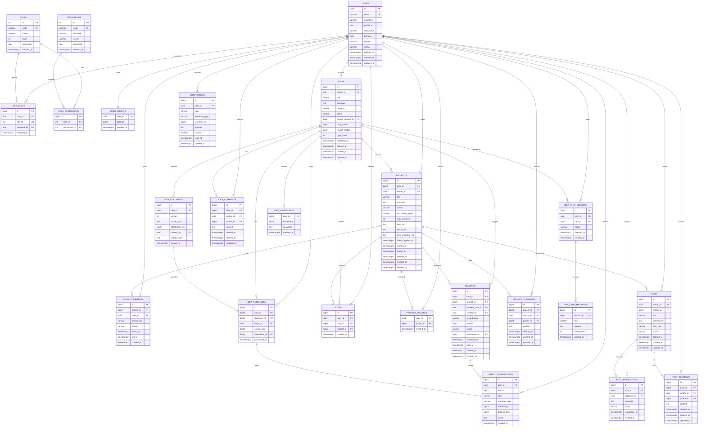

# ERD (Mermaid)

mermaid.live 또는 VSCode mermaid preview에서 렌더링 가능. AI assistant가 도메인 구조 빠르게 파악할 때도 유용.

```mermaid
erDiagram
  USERS ||--o{ USER_ROLES : assigned
  ROLES ||--o{ USER_ROLES : grants
  ROLES ||--o{ ROLE_PERMISSIONS : has
  PERMISSIONS ||--o{ ROLE_PERMISSIONS : mapped
  USERS ||--|| USER_CREDITS : owns
  USERS ||--o{ CREDIT_TRANSACTIONS : records
  USERS ||--o{ IDEAS : authors
  USERS ||--o{ PROJECTS : leads
  USERS ||--o{ PROJECT_MEMBERS : joins
  USERS ||--o{ POSTS : writes
  USERS ||--o{ POST_APPLICATIONS : applies
  USERS ||--o{ HYPES : creates
  USERS ||--o{ PROJECT_FOLLOWS : follows
  USERS ||--o{ IDEA_PURCHASES : buys
  USERS ||--o{ IDEA_CHAT_SESSIONS : starts
  USERS ||--o{ NOTIFICATIONS : receives
  USERS ||--o{ IDEA_COMMENTS : authors
  USERS ||--o{ PROJECT_COMMENTS : authors
  USERS ||--o{ POST_COMMENTS : authors
  IDEAS ||--o{ IDEA_DOCUMENTS : versions
  IDEAS ||--o{ IDEA_CHAT_SESSIONS : produces
  IDEA_CHAT_SESSIONS ||--o{ IDEA_CHAT_MESSAGES : contains
  IDEAS ||--o| IDEA_EMBEDDINGS : indexed
  IDEAS ||--o{ IDEA_PURCHASES : sold
  IDEA_DOCUMENTS ||--o{ IDEA_PURCHASES : snapshot
  IDEAS ||--o{ HYPES : receives
  IDEAS ||--o{ IDEA_COMMENTS : has
  IDEAS ||--o{ REWARDS : triggers
  IDEAS ||--o{ PROJECTS : sources
  PROJECTS ||--o{ PROJECT_MEMBERS : has
  PROJECTS ||--o{ PROJECT_COMMENTS : has
  PROJECTS ||--o{ PROJECT_FOLLOWS : followed
  PROJECTS ||--o{ HYPES : receives
  PROJECTS ||--o{ REWARDS : produces
  PROJECTS ||--o{ POSTS : promoted
  POSTS ||--o{ POST_COMMENTS : has
  POSTS ||--o{ POST_APPLICATIONS : receives
  REWARDS ||--o{ CREDIT_TRANSACTIONS : settles
  IDEA_PURCHASES ||--|| CREDIT_TRANSACTIONS : pays

  USERS {
    uuid id PK
    varchar email UK
    varchar nickname
    text profile_url
    varchar real_name
    date birthday
    varchar gender
    varchar status
    timestamptz deleted_at
    timestamptz created_at
    timestamptz updated_at
  }
  ROLES {
    int id PK
    varchar code UK
    varchar name
    int level
    text description
    timestamptz created_at
  }
  PERMISSIONS {
    int id PK
    varchar code UK
    varchar resource
    varchar action
    text description
    timestamptz created_at
  }
  USER_ROLES {
    bigint id PK
    uuid user_id FK
    int role_id FK
    uuid assigned_by FK
    timestamptz assigned_at
  }
  ROLE_PERMISSIONS {
    bigint id PK
    int role_id FK
    int permission_id FK
  }
  USER_CREDITS {
    uuid user_id PK
    bigint balance
    timestamptz updated_at
  }
  CREDIT_TRANSACTIONS {
    bigint id PK
    uuid user_id FK
    bigint amount
    varchar type
    varchar reference_type
    bigint reference_id
    bigint balance_after
    text memo
    timestamptz created_at
  }
  IDEAS {
    bigint id PK
    uuid author_id FK
    varchar title
    text summary
    varchar category
    varchar status
    bigint current_version_id FK
    bigint price_credits
    bigint reward_credits
    int hype_count
    timestamptz published_at
    timestamptz deleted_at
    timestamptz created_at
    timestamptz updated_at
  }
  IDEA_DOCUMENTS {
    bigint id PK
    bigint idea_id FK
    int version
    text content_md
    jsonb attachment_urls
    uuid created_by FK
    text change_note
    timestamptz created_at
  }
  IDEA_CHAT_SESSIONS {
    bigint id PK
    uuid user_id FK
    bigint idea_id FK
    varchar status
    timestamptz finalized_at
    timestamptz created_at
  }
  IDEA_CHAT_MESSAGES {
    bigint id PK
    bigint session_id FK
    varchar role
    text content
    int token_count
    timestamptz created_at
  }
  IDEA_EMBEDDINGS {
    bigint idea_id PK
    vector embedding
    text keywords
    timestamptz updated_at
  }
  IDEA_PURCHASES {
    bigint id PK
    bigint idea_id FK
    bigint document_id FK
    uuid buyer_id FK
    bigint credits_paid
    bigint transaction_id FK
    timestamptz purchased_at
  }
  PROJECTS {
    bigint id PK
    bigint idea_id FK
    uuid leader_id FK
    varchar title
    text summary
    varchar status
    boolean recruitment_open
    int max_members
    text repo_url
    text demo_url
    text idea_snapshot_md
    timestamptz idea_snapshot_at
    timestamptz started_at
    timestamptz ended_at
    timestamptz deleted_at
    timestamptz created_at
    timestamptz updated_at
  }
  PROJECT_MEMBERS {
    bigint id PK
    bigint project_id FK
    uuid user_id FK
    varchar project_role
    varchar status
    timestamptz joined_at
    timestamptz left_at
    timestamptz created_at
  }
  PROJECT_FOLLOWS {
    uuid user_id PK
    bigint project_id PK
    timestamptz created_at
  }
  HYPES {
    bigint id PK
    uuid user_id FK
    bigint idea_id FK
    bigint project_id FK
    timestamptz created_at
  }
  REWARDS {
    bigint id PK
    bigint idea_id FK
    bigint project_id FK
    uuid recipient_user_id FK
    uuid created_by FK
    varchar reward_type
    bigint amount
    varchar status
    bigint transaction_id FK
    timestamptz approved_at
    timestamptz paid_at
    timestamptz created_at
    timestamptz updated_at
  }
  POSTS {
    bigint id PK
    uuid author_id FK
    bigint project_id FK
    varchar title
    text content_md
    varchar post_type
    varchar status
    timestamptz deleted_at
    timestamptz created_at
    timestamptz updated_at
  }
  POST_APPLICATIONS {
    bigint id PK
    bigint post_id FK
    uuid applicant_id FK
    text message
    varchar status
    timestamptz responded_at
    timestamptz created_at
  }
  IDEA_COMMENTS {
    bigint id PK
    bigint idea_id FK
    uuid author_id FK
    bigint parent_id FK
    text content
    timestamptz deleted_at
    timestamptz created_at
    timestamptz updated_at
  }
  PROJECT_COMMENTS {
    bigint id PK
    bigint project_id FK
    uuid author_id FK
    bigint parent_id FK
    text content
    timestamptz deleted_at
    timestamptz created_at
    timestamptz updated_at
  }
  POST_COMMENTS {
    bigint id PK
    bigint post_id FK
    uuid author_id FK
    bigint parent_id FK
    text content
    timestamptz deleted_at
    timestamptz created_at
    timestamptz updated_at
  }
  NOTIFICATIONS {
    bigint id PK
    uuid user_id FK
    varchar type
    varchar reference_type
    bigint reference_id
    text payload
    boolean is_read
    timestamptz read_at
    timestamptz created_at
  }
```
